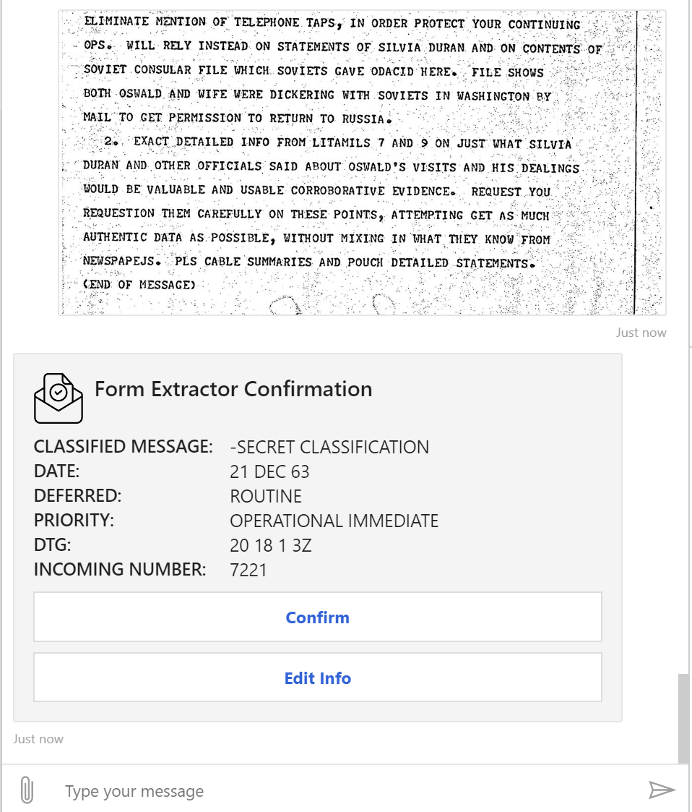
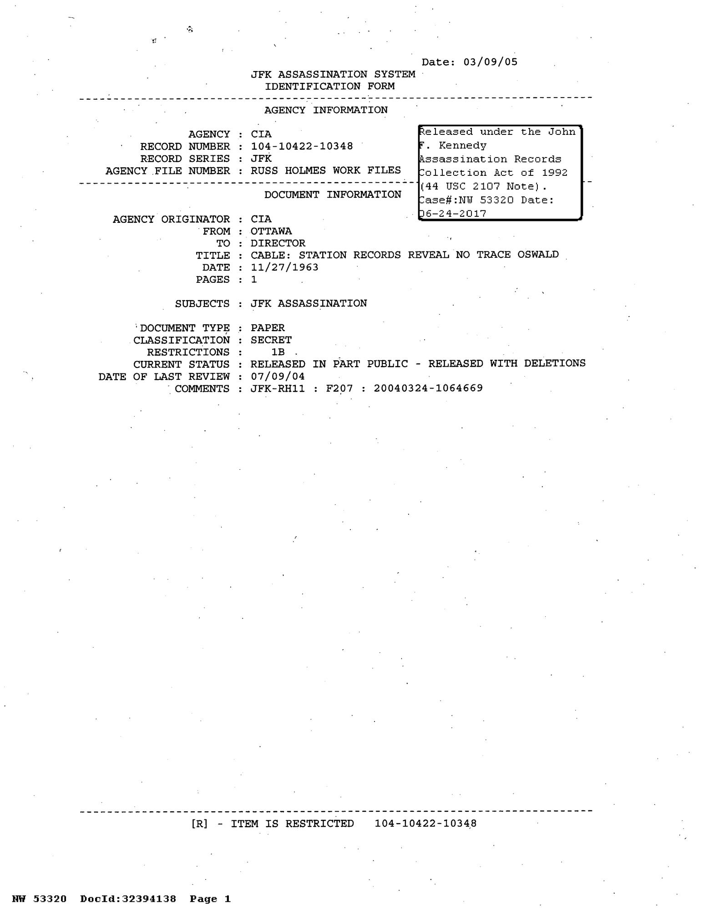
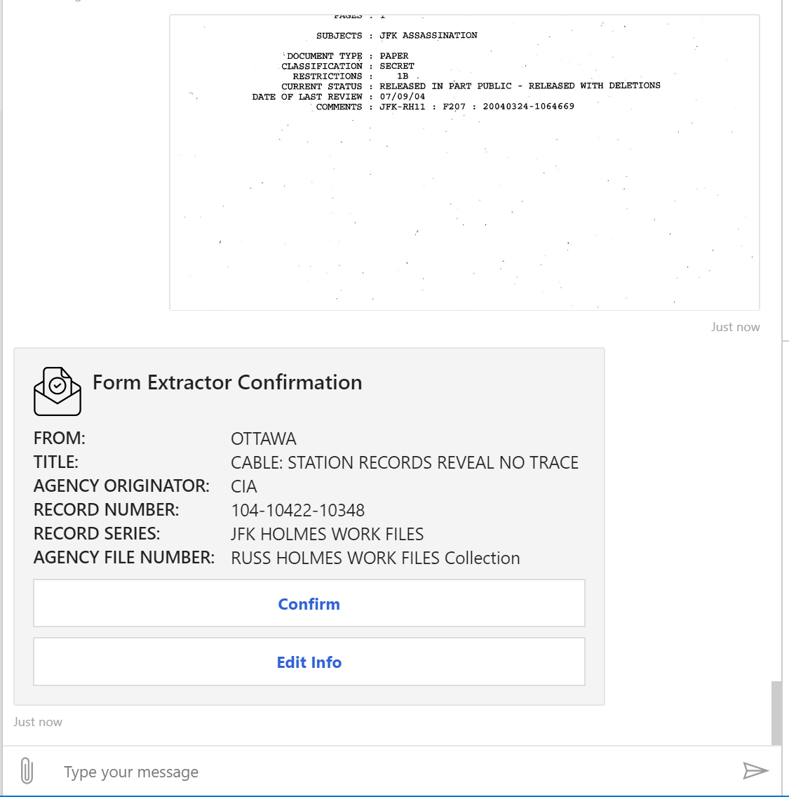
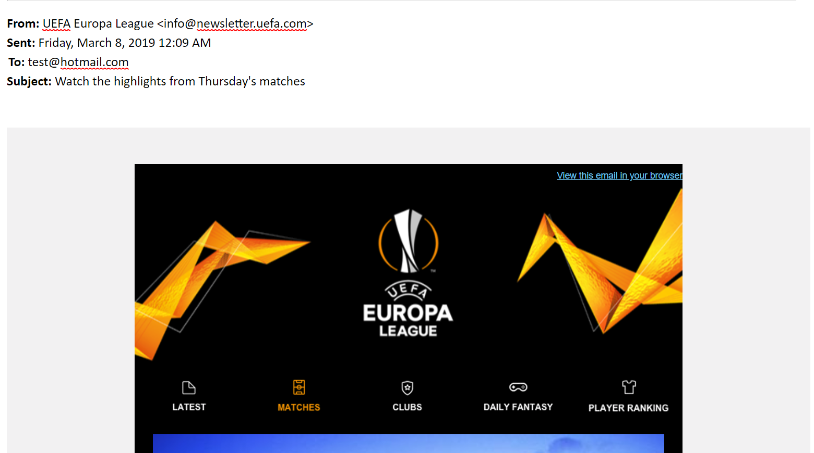
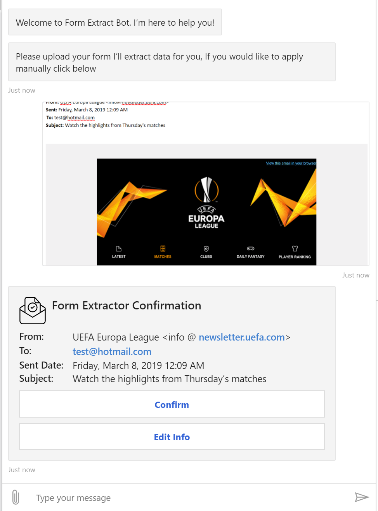

# Extract Key-Value pairs from OCR output in Bot

This bot is a sample bot that accepts Form Image inputs from the user and extract needed information into a card and reply user back. You can use structured and semi-structured Forms to Extract details.

As a test dataset I extracted some e-mails into a form structure then used these structured e-mails to extract key-value pairs.

This bot has been created using [Microsoft Bot Framework][1].

## Defining Reference Text (Key) and Desired Value Margins
Search data notation is like below format:

```json
{
  "id": 2,
  "text": "PRIORITY",   // Your Reference Text Value
  "marginX": -30,       // Margin to left of your value field
  "marginY": -30,       // Margin to left top your value field
  "width": 100,         // Width of your text area
  "height": 100         // Height of your text area
}
```

The output for above details will be like below


---
## Extract Key-Values from Mixed Structured Content

Let's use one of the files from JFK Files like below we're targeting to extract 
`CLASSIFIED MESSAGE` , `DEFERRED` , `PRIORITY`, `DTG`, `INCOMING NUMBER` and  `DATE` values. 


JSON fields for regions will be like below.

```json
[
  {
    "id": 0,
    "text": "CLASSIFIED MESSAGE",
    "marginX": 5,
    "marginY": -30,
    "width": 200,
    "height": 120
  },
  {
    "id": 1,
    "text": "DEFERRED",
    "marginX": -30,
    "marginY": -30,
    "width": 100,
    "height": 100
  },
  {
    "id": 2,
    "text": "PRIORITY",
    "marginX": -30,
    "marginY": -30,
    "width": 100,
    "height": 100
  },
  {
    "id": 3,
    "text": "DTG",
    "marginX": 5,
    "marginY": -30,
    "width": 200,
    "height": 200
  },
  {
    "id": 4,
    "text": "INCOMING NUMBER",
    "marginX": 0,
    "marginY": -30,
    "width": 200,
    "height": 100
  },
  {
    "id": 5,
    "text": "DATE",
    "marginX": 50,
    "marginY": 20,
    "width": 300,
    "height": 50
  }
]
```
After above definitions search regions will be set like below


And after that, we'll be succesfully extract like below. 




## Extract Key-Values from Semi-Structured Content

Let's use one of the files from JFK Files like below we're targeting to extract 
`FROM` , `TITLE` , `AGENCY ORIGINATOR`, `RECORD NUMBER`, `RECORD SERIES` and  `AGENCY FILE NUMBER` values. 



 
JSON fields for regions will be like below.

```json
[
  {
    "id": 0,
    "text": "RECORD NUMBER",
    "marginX": 220,
    "marginY": 5,
    "width": 300,
    "height": 25
  },
  {
    "id": 1,
    "text": "RECORD SERIES",
    "marginX": 220,
    "marginY": 5,
    "width": 300,
    "height": 20
  },
  {
    "id": 2,
    "text": "AGENCY FILE NUMBER",
    "marginX": 300,
    "marginY": 5,
    "width": 300,
    "height": 25
  },
  {
    "id": 3,
    "text": "AGENCY ORIGINATOR",
    "marginX": 200,
    "marginY": 5,
    "width": 150,
    "height": 25
  },
    {
    "id": 4,
    "text": "FROM",
    "marginX": 50,
    "marginY": 5,
    "width": 150,
    "height": 25
  },
 {
    "id": 5,
    "text": "TITLE",
    "marginX": 50,
    "marginY": 5,
    "width": 600,
    "height": 25
  }
]
```

After above definitions search regions will be set like below


And after that, we'll be succesfully extract like below.



---

In same structure let's assume our sample is like semi-structured like below e-mail.



We'll be looking for in this image, basically to detect `From`, `To`, `Sent`, `Subject` fields location first then find values next to these fields. Generally in these type for forms value width is dynamic, for this reason we're using dynamic width/heigh/margins per Key-Value pair.


```json
[
    {
      "id": 0,
      "text": "From",
      "marginX": 5,
      "marginY": 5,
      "width": 800,
      "height": 25
    },
    {
      "id": 1,
      "text": "Sent",
      "marginX": 5,
      "marginY": 5,
      "width": 400,
      "height": 25
    },
    {
      "id": 2,
      "text": "To",
      "marginX": 5,
      "marginY": 5,
      "width": 300,
      "height": 25
    },
    {
      "id": 3,
      "text": "Subject",
      "marginX": 5,
      "marginY": 5,
      "width": 900,
      "height": 25
    }
]
```

After above definitions search regions will be set like below


When we use above settings our output is like below


## Extract Key-Values from Table / Semi-Structured Content
Let's assume we have a table structured key-value pairs like below. And let's do small changes to export these fields.


I changed my `SampleData.json` file under Resources like below.
```json
[
  {
    "id": 0,
    "text": "Date",
    "marginX": 50,
    "marginY": 5,
    "width": 400,
    "height": 25
  },
  {
    "id": 1,
    "text": "Company",
    "marginX": 50,
    "marginY": 5,
    "width": 400,
    "height": 25
  },
  {
    "id": 2,
    "text": "Total",
    "marginX": 50,
    "marginY": 5,
    "width": 400,
    "height": 25
  },
  {
    "id": 3,
    "text": "Card",
    "marginX": 50,
    "marginY": 5,
    "width": 400,
    "height": 25
  },
  {
    "id": 4,
    "text": "Method",
    "marginX": 50,
    "marginY": 5,
    "width": 400,
    "height": 25
  }
]
```

After above changes output will be like below


Hope this will be helpful.


# Prerequisites
- [Visual Studio 2017 15.7][2] or newer installed.
- [.Net Core 2.1][3] or higher installed.  
- [Bot Framework Emulator 4.1][6] or newer installed

# Running Locally

## Visual Studio
- Open BotOCRExtract.csproj in Visual Studio.
- Run the project (press `F5` key).

## Testing the bot using Bot Framework Emulator
[Microsoft Bot Framework Emulator][5] is a desktop application that allows bot 
developers to test and debug their bots on localhost or running remotely through a tunnel.
- Install the [Bot Framework emulator][6].

## Connect to bot using Bot Framework Emulator **V4**
- Launch the Bot Framework Emulator.
- File -> Open bot and open [BotOCRExtract.bot](BotOCRExtract.bot).

# Deploy the bot to Azure
See [Deploy your C# bot to Azure][50] for instructions.

The deployment process assumes you have an account on Microsoft Azure and are able to log into the [Microsoft Azure Portal][60].

If you are new to Microsoft Azure, please refer to [Getting started with Azure][70] for guidance on how to get started on Azure.

# Further reading
* [Bot Framework Documentation][80]
* [Bot Basics][90]
* [Azure Bot Service Introduction][100]
* [Azure Bot Service Documentation][110]
* [Azure CLI][120]
* [msbot CLI][130]
* [Azure Portal][140]
* [Language Understanding using LUIS][150]

[1]: https://dev.botframework.com
[2]: https://docs.microsoft.com/en-us/visualstudio/releasenotes/vs2017-relnotes
[3]: https://dotnet.microsoft.com/download/dotnet-core/2.1
[5]: https://github.com/microsoft/botframework-emulator
[6]: https://aka.ms/botframeworkemulator

[10]: https://azure.microsoft.com/free/
[11]: https://docs.microsoft.com/cli/azure/install-azure-cli?view=azure-cli-latest

[50]: https://docs.microsoft.com/en-us/azure/bot-service/bot-builder-howto-deploy-azure?view=azure-bot-service-4.0
[60]: https://portal.azure.com
[70]: https://azure.microsoft.com/get-started/
[80]: https://docs.botframework.com
[90]: https://docs.microsoft.com/en-us/azure/bot-service/bot-builder-basics?view=azure-bot-service-4.0
[100]: https://docs.microsoft.com/en-us/azure/bot-service/bot-service-overview-introduction?view=azure-bot-service-4.0
[110]: https://docs.microsoft.com/en-us/azure/bot-service/?view=azure-bot-service-4.0
[120]: https://docs.microsoft.com/en-us/cli/azure/?view=azure-cli-latest
[130]: https://github.com/Microsoft/botbuilder-tools/tree/master/packages/MSBot
[140]: https://portal.azure.com
[150]: https://www.luis.ai